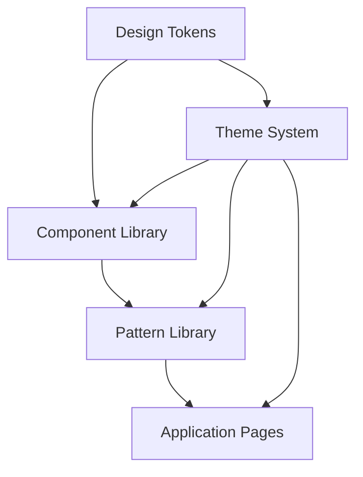

# Design Document: Visual Design and UI/UX Improvements

## Overview

This design document outlines a comprehensive approach to enhancing the visual design and user experience of the Nexora business suite application. The improvements focus on creating a modern, accessible, and cohesive design system that elevates the professional appearance while maintaining usability and performance.

The design leverages current trends in enterprise application design, including refined color systems, improved typography, enhanced component interactions, and modern visual effects. All improvements are designed to be implemented incrementally while maintaining backward compatibility.

## Architecture

### Design System Architecture

The enhanced design system follows a token-based architecture with four primary layers:

1. **Design Tokens Layer**: Foundational values for colors, spacing, typography, and effects
2. **Component Library Layer**: Reusable UI components with consistent styling and behavior
3. **Pattern Library Layer**: Common layout patterns and interaction flows
4. **Theme Layer**: Light/dark mode support and customization options



### File Structure Enhancement

The design system will be organized as follows:

```
src/styles/
├── tokens/
│   ├── colors.css (enhanced)
│   ├── typography.css (enhanced)
│   ├── spacing.css (enhanced)
│   ├── shadows.css (new)
│   ├── animations.css (new)
│   └── themes.css (new)
├── components/
│   ├── buttons.css (enhanced)
│   ├── forms.css (enhanced)
│   ├── cards.css (enhanced)
│   ├── navigation.css (enhanced)
│   └── data-display.css (new)
├── patterns/
│   ├── layouts.css (new)
│   ├── dashboard.css (new)
│   └── workflows.css (new)
└── utilities/
    ├── accessibility.css (new)
    ├── responsive.css (enhanced)
    └── performance.css (new)
```

## Components and Interfaces

### Enhanced Color System

**Primary Color Palette**
- Primary Blue: #2563eb (maintaining brand consistency)
- Supporting colors derived from primary with mathematical precision
- Semantic colors for success, warning, error, and info states
- Neutral grays with improved contrast ratios

**Accessibility-First Approach**
- All color combinations meet WCAG 2.1 AA standards (4.5:1 minimum contrast)
- Large text meets 3:1 contrast ratio requirements
- UI components maintain 3:1 contrast with adjacent colors
- Color-blind friendly palette with sufficient luminance differences

### Typography Enhancement

**Font Stack Optimization**
- Primary: Inter (enhanced with better font weights)
- Display: Poppins for headings and hero text
- Monospace: Fira Code for code and data display

**Type Scale Refinement**
- Mathematical scale based on 1.25 ratio for harmonious progression
- Improved line heights for better readability
- Enhanced letter spacing for optimal character recognition
- Responsive typography that scales appropriately across devices

### Component Design Improvements

**Button System**
- Enhanced visual hierarchy with 5 distinct variants
- Improved hover and focus states with smooth transitions
- Loading states with skeleton animations
- Consistent sizing system (sm, md, lg, xl)
- Icon integration with proper spacing

**Form Components**
- Floating label design for better space utilization
- Clear validation states with helpful messaging
- Improved focus indicators for accessibility
- Consistent spacing and alignment
- Enhanced error handling with contextual help

**Card Components**
- Subtle elevation system using shadows and borders
- Improved content hierarchy within cards
- Hover effects that provide clear interaction feedback
- Responsive card layouts for different screen sizes
- Loading states with skeleton screens

**Navigation Enhancement**
- Improved visual hierarchy in navigation menus
- Better active state indicators
- Smooth transitions between navigation states
- Mobile-optimized navigation patterns
- Breadcrumb improvements for better wayfinding

## Data Models

### Design Token Structure

```typescript
interface DesignTokens {
  colors: {
    primary: ColorScale;
    neutral: ColorScale;
    semantic: SemanticColors;
    surface: SurfaceColors;
  };
  typography: {
    fontFamilies: FontFamilies;
    fontSizes: FontSizeScale;
    fontWeights: FontWeightScale;
    lineHeights: LineHeightScale;
  };
  spacing: SpacingScale;
  shadows: ShadowScale;
  animations: AnimationTokens;
  breakpoints: BreakpointScale;
}

interface ColorScale {
  50: string;
  100: string;
  200: string;
  300: string;
  400: string;
  500: string;
  600: string;
  700: string;
  800: string;
  900: string;
}

interface SemanticColors {
  success: ColorScale;
  warning: ColorScale;
  error: ColorScale;
  info: ColorScale;
}
```

### Component State Management

```typescript
interface ComponentState {
  variant: 'primary' | 'secondary' | 'ghost' | 'danger' | 'success';
  size: 'sm' | 'md' | 'lg' | 'xl';
  state: 'default' | 'hover' | 'active' | 'disabled' | 'loading';
  theme: 'light' | 'dark' | 'auto';
}
```

### Theme Configuration

```typescript
interface ThemeConfig {
  mode: 'light' | 'dark' | 'auto';
  primaryColor: string;
  borderRadius: 'none' | 'sm' | 'md' | 'lg' | 'xl';
  density: 'compact' | 'comfortable' | 'spacious';
  animations: 'none' | 'reduced' | 'full';
}
```

## Correctness Properties

*A property is a characteristic or behavior that should hold true across all valid executions of a system—essentially, a formal statement about what the system should do. Properties serve as the bridge between human-readable specifications and machine-verifiable correctness guarantees.*

Before defining the correctness properties, I need to analyze the acceptance criteria from the requirements document to determine which ones are testable.

### Property Reflection

After reviewing all testable properties from the prework analysis, I've identified several areas where properties can be consolidated to eliminate redundancy:

- Properties 2.2 and 4.2 both test animation smoothness - can be combined into one comprehensive animation property
- Properties 4.4 and 7.2 both test loading states - these are identical and should be consolidated
- Properties 1.1 and 5.1 both test color contrast - can be combined into one comprehensive contrast property
- Properties 1.2, 2.1, and 7.5 all test interactive feedback - can be combined into one comprehensive interaction property

The following properties provide unique validation value and will be implemented:

### Correctness Properties

Property 1: Color contrast compliance
*For any* color combination used in the design system, the contrast ratio should meet WCAG 2.1 AA standards (4.5:1 for normal text, 3:1 for large text and UI components)
**Validates: Requirements 1.1, 5.1, 8.1, 8.4**

Property 2: Interactive element consistency
*For any* interactive UI component, it should have all required visual states defined (default, hover, active, disabled, loading) with immediate feedback
**Validates: Requirements 1.2, 2.1, 7.5**

Property 3: Typography scale harmony
*For any* font size in the typography scale, it should follow the mathematical ratio relationship (1.25x) to create visual hierarchy
**Validates: Requirements 1.3**

Property 4: Design token consistency
*For any* UI component, spacing and sizing values should use design tokens from the defined scale rather than arbitrary values
**Validates: Requirements 1.4, 2.4, 3.1, 3.2**

Property 5: Animation performance optimization
*For any* animation or transition, it should use transform and opacity properties and have duration values optimized for 60fps performance
**Validates: Requirements 2.2, 4.2, 7.3**

Property 6: Form validation state completeness
*For any* form component, it should have CSS classes defined for all validation states (error, success, warning, default)
**Validates: Requirements 2.5**

Property 7: Navigation active state indication
*For any* navigation component, it should have clear visual indicators for active/current states
**Validates: Requirements 2.3**

Property 8: Responsive breakpoint coverage
*For any* UI component, it should have responsive styles defined for all supported breakpoints (mobile, tablet, desktop)
**Validates: Requirements 3.4, 6.1, 6.2**

Property 9: Component alignment consistency
*For any* UI component within a container, it should use consistent alignment classes and properties
**Validates: Requirements 3.5**

Property 10: Visual effects implementation
*For any* component requiring depth or visual interest, it should use defined shadow and gradient tokens rather than custom values
**Validates: Requirements 4.1, 4.3**

Property 11: Loading state availability
*For any* component that displays dynamic content, it should have loading state CSS classes and skeleton screen styles defined
**Validates: Requirements 4.4, 7.2**

Property 12: Focus indicator visibility
*For any* interactive element, it should have clearly visible focus indicators that meet accessibility requirements
**Validates: Requirements 5.2**

Property 13: Semantic markup completeness
*For any* UI component, it should include proper semantic HTML elements and ARIA attributes for screen reader support
**Validates: Requirements 5.3**

Property 14: Touch target size compliance
*For any* interactive element, it should meet the minimum 44px touch target size requirement for mobile accessibility
**Validates: Requirements 5.4**

Property 15: Reduced motion respect
*For any* animation or transition, it should be disabled or reduced when the user has prefers-reduced-motion preference set
**Validates: Requirements 5.5**

Property 16: Mobile navigation pattern implementation
*For any* navigation component, it should have mobile-friendly patterns (hamburger menu, collapsible sections) defined
**Validates: Requirements 6.5**

Property 17: CSS performance optimization
*For any* CSS rule, it should follow performance best practices (avoid layout-triggering properties, use efficient selectors)
**Validates: Requirements 7.1**

Property 18: Theme transition smoothness
*For any* component, switching between light and dark themes should have smooth transition properties defined
**Validates: Requirements 8.2**

Property 19: Semantic color preservation
*For any* semantic color (success, warning, error, info), its relative meaning and contrast relationships should be maintained across both light and dark themes
**Validates: Requirements 8.5**

## Error Handling

### Design System Error Prevention

**Invalid Color Usage**
- Implement CSS custom properties validation to prevent invalid color values
- Use design token constraints to ensure only approved colors are used
- Provide fallback colors for unsupported color formats

**Accessibility Violations**
- Implement automated contrast ratio checking during build process
- Provide warnings for insufficient color contrast
- Ensure focus indicators are always visible with fallback styles

**Responsive Layout Failures**
- Use CSS Grid and Flexbox with proper fallbacks
- Implement container queries where supported with graceful degradation
- Provide minimum and maximum width constraints to prevent layout breaks

**Animation Performance Issues**
- Use `will-change` property judiciously to optimize animations
- Implement `prefers-reduced-motion` media query support
- Provide fallback static states for complex animations

**Theme Switching Errors**
- Ensure all components have both light and dark theme styles
- Implement CSS custom property fallbacks for theme values
- Provide system theme detection with manual override capability

### Component Error States

**Loading State Failures**
- Implement timeout handling for loading states
- Provide error states when loading fails
- Ensure loading indicators don't persist indefinitely

**Form Validation Errors**
- Provide clear error messaging with specific guidance
- Implement real-time validation with debounced feedback
- Ensure error states are clearly distinguishable from normal states

**Navigation Errors**
- Implement fallback navigation patterns for JavaScript failures
- Provide clear indication of current page location
- Ensure navigation remains accessible without JavaScript

## Testing Strategy

### Dual Testing Approach

The design system improvements will be validated through both unit testing and property-based testing to ensure comprehensive coverage:

**Unit Tests**: Focus on specific examples, edge cases, and integration points
- Test specific color combinations for contrast compliance
- Verify component state transitions work correctly
- Test responsive breakpoint behavior at specific viewport sizes
- Validate accessibility attributes are present on components
- Test theme switching functionality with specific scenarios

**Property-Based Tests**: Verify universal properties across all inputs
- Generate random color combinations and verify contrast ratios
- Test all interactive components have required states defined
- Verify typography scale mathematical relationships
- Test design token usage across all components
- Validate animation performance across different scenarios

### Property-Based Testing Configuration

All property-based tests will be implemented using **fast-check** (for TypeScript/JavaScript) with the following configuration:
- Minimum 100 iterations per property test to ensure comprehensive coverage
- Each property test will be tagged with a comment referencing its design document property
- Tag format: **Feature: design-improvements, Property {number}: {property_text}**

### Testing Implementation Strategy

**CSS Testing Approach**
- Use computed style testing to verify CSS properties are applied correctly
- Implement visual regression testing for component appearance
- Use accessibility testing tools to verify WCAG compliance
- Test responsive behavior across multiple viewport sizes

**Performance Testing**
- Measure animation frame rates to ensure 60fps performance
- Test CSS bundle size and loading performance
- Verify layout shift metrics remain within acceptable thresholds
- Test theme switching performance and smoothness

**Accessibility Testing**
- Automated contrast ratio testing for all color combinations
- Keyboard navigation testing for all interactive elements
- Screen reader testing with semantic markup validation
- Touch target size validation for mobile interfaces

**Cross-Browser Testing**
- Test design system compatibility across modern browsers
- Verify CSS custom property support and fallbacks
- Test responsive design behavior across different devices
- Validate animation and transition support

The testing strategy ensures that both specific implementation details and universal design principles are validated, providing confidence in the design system's quality and consistency.